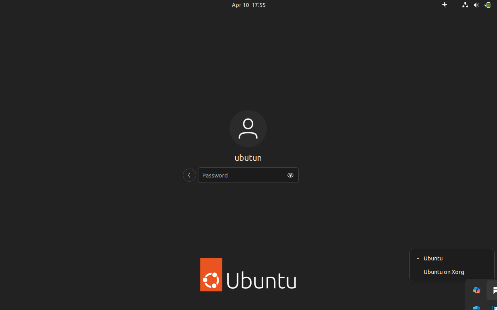
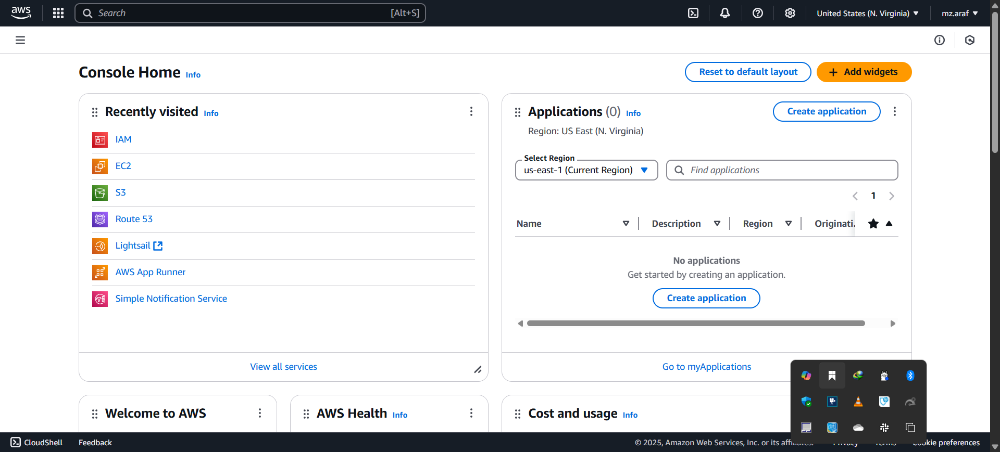

# Tech Environment Setup
## Tools Installed
1. Visual Studio Code (VScode)
vscode was downloaded from https://code.visualstudio.com/download and installed. screenshot below:

2. Git
Git was downloaded from https://git-scm.com/downloads and installed. screenshot below:

3. Virtual Box
Virtual Box was downloaded from https://www.virtualbox.org/wiki/Downloads and installed. screenshot below:

4. Ubuntu on Virtual Box (Windows)
Ubuntu was downloaded from https://ubuntu.com/download/desktop and installed on Virtual Box. screenshot below:

## Accounts Created
1. Github Account
Github account was created at https://github.com/. screenshot below:

2. Amazon Web Services (AWS) Account
AWS account was created at https://aws.amazon.com/. screenshot below:
